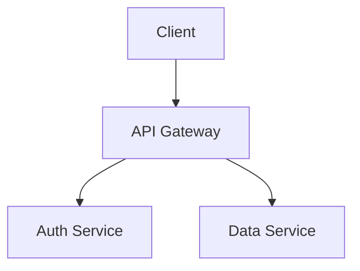
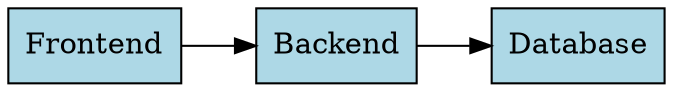

# MarkdownFly (mfly) 🚀

> **AI-powered Markdown to PowerPoint (.pptx) CLI tool designed for developers.**
> Write in Markdown with syntax-highlighted code and embedded diagrams; generate beautiful, editable slides in seconds.

---

## ✨ Features

- 📑 **Markdown to PowerPoint**: Convert standard Markdown to editable 16:9 widescreen `.pptx` slides.
- 🎨 **Syntax Highlighting**: Token-level code highlighting powered by [Shiki](https://shiki.style/) (Python, TypeScript, Go, Rust, Java, C++, Bash, SQL, and 20+ languages).
- 📊 **Built-in Diagram Rendering (Zero native binary dependencies)**:
  - **Mermaid**: Flowcharts, sequence diagrams, state diagrams, class diagrams.
  - **Graphviz / DOT**: Network graphs, finite state machines, architecture topologies (via WASM).
  - **ECharts**: Bar charts, line charts, pie charts directly from JSON options (via ECharts SSR).
- 🖼️ **Image Embedding**: Local file paths, remote URLs (`http://`/`https://`), and base64 Data URIs.
- 📐 **Automatic Layout Detection**: Title slides, section dividers, code spotlights, quotes, and content slides.
- ⚡ **Batch Conversion**: Convert multiple files with glob support (`mfly *.md`).
- 🤖 **AI-Ready Architecture**: Pluggable AI enhancement pipeline for automated layout advisory, content polishing, and speaker notes.
- ⚙️ **Config & Key Management**: Secure CLI commands for API keys (`~/.markdownfly/config.json`).

---

## 📦 Installation

```bash
# Clone and install dependencies
git clone https://github.com/markdownfly/markdownfly.git
cd markdownFly
pnpm install
pnpm build
```

Link locally for global CLI access:
```bash
pnpm link --global
```

---

## 🚀 Quick Start

### 1. Basic Usage

```bash
# Convert a single file (auto-named to slides.pptx)
mfly slides.md

# Specify custom output path
mfly slides.md -o presentation.pptx

# Batch convert multiple Markdown files
mfly docs/*.md
```

### 2. Configuration & API Keys

```bash
# Set OpenAI API key for AI features
mfly config set OPENAI_API_KEY sk-your-key-here

# View masked API key
mfly config get OPENAI_API_KEY

# List all configurations
mfly config list

# Remove configuration
mfly config delete OPENAI_API_KEY
```

---

## 📝 Markdown Syntax Guide

### Slide Splitting Rules

- `---` (Horizontal Rule): Primary slide separator.
- `# Heading 1`: Creates a new slide with **Title** (cover) layout.
- `## Heading 2`: Creates a new slide with **Content** or **Section** layout.

### Frontmatter

```yaml
---
theme: default
author: "Your Name"
footer: "Confidential - 2026"
---
```

### Code Blocks with Syntax Highlighting

````markdown
```typescript
interface User {
  id: string;
  name: string;
}

function greet(user: User): string {
  return `Hello, ${user.name}!`;
}
```
````

### Diagram Code Blocks

````markdown




```echarts
{
  "xAxis": { "type": "category", "data": ["Q1", "Q2", "Q3", "Q4"] },
  "yAxis": { "type": "value" },
  "series": [{ "data": [150, 230, 224, 218], "type": "bar" }]
}
```
````

---

## 🧪 Testing

```bash
# Run all unit and integration tests
pnpm test
```

---

## 📄 License

MIT License © 2026 MarkdownFly Contributors
