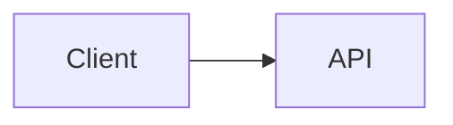
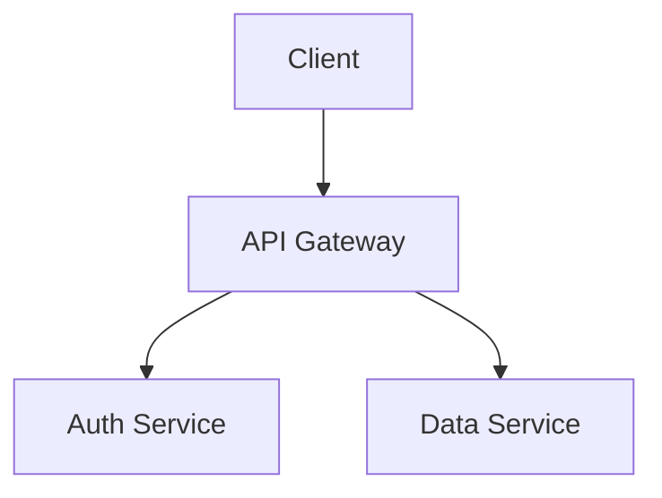
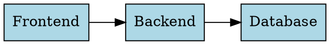

# MarkdownFly (mfly) 🚀

> **AI-powered Markdown to PowerPoint (.pptx) CLI tool designed for developers.**
> Write in Markdown with syntax-highlighted code and embedded diagrams; generate beautiful, editable slides in seconds.

---

## ✨ Features

- 📑 **Markdown to PowerPoint**: Convert standard Markdown to editable 16:9 widescreen `.pptx` slides.
- 🎨 **Syntax Highlighting**: Token-level code highlighting powered by [Shiki](https://shiki.style/) (Python, TypeScript, Go, Rust, Java, C++, Bash, SQL, and 20+ languages).
- 📊 **Built-in Diagram Rendering (Zero native binary dependencies)**:
  - **Mermaid**: Flowcharts, sequence diagrams, state diagrams, class diagrams.
  - **Graphviz / DOT**: Network graphs, finite state machines, architecture topologies (via WASM).
  - **ECharts**: Bar charts, line charts, pie charts directly from JSON options (via ECharts SSR).
- 🖼️ **Image Embedding**: Local file paths, remote URLs (`http://`/`https://`), and base64 Data URIs.
- 📐 **Automatic Layout Detection**: Title slides, section dividers, code spotlights, quotes, and content slides.
- ⚡ **Batch Conversion**: Convert multiple files with glob support (`mfly *.md`).
- 🤖 **AI-Ready Architecture**: Pluggable AI enhancement pipeline for automated layout advisory, content polishing, and speaker notes.
- ⚙️ **Config & Key Management**: Secure CLI commands for API keys (`~/.markdownfly/config.json`).

---

## 📦 Installation

```bash
# Clone and install dependencies
git clone https://github.com/markdownfly/markdownfly.git
cd markdownFly
pnpm install
pnpm build
```

Link locally for global CLI access:
```bash
pnpm link --global
```

---

## 🚀 Quick Start

### 1. Basic Usage

```bash
# Convert a single file (auto-named to slides.pptx)
mfly slides.md

# Specify theme (clean, academic, dark, business, warm, aurora, neon, nord, dracula, beige, ink)
mfly slides.md -t dark

# Specify custom output path
mfly slides.md -t academic -o presentation.pptx

# Batch convert multiple Markdown files
mfly docs/*.md
```

### 2. Configuration & API Keys

```bash
# Set OpenAI API key for AI features
mfly config set OPENAI_API_KEY sk-your-key-here

# View masked API key
mfly config get OPENAI_API_KEY

# List all configurations
mfly config list

# Remove configuration
mfly config delete OPENAI_API_KEY
```

---

## 🎨 Built-in Themes

| Theme | Style / Mood | Primary Colors | Best For |
| :--- | :--- | :--- | :--- |
| **`clean`** *(default)* | Modern clean tech | White `#FFFFFF` / Blue `#2563EB` | General developer presentations & tech sharing |
| **`academic`** | Scholarly LaTeX Beamer | White `#FFFFFF` / Prussian Blue `#003366` | Papers, algorithms, research defenses |
| **`dark`** | Dark mode geek | Dark Slate `#0F172A` / Cyan `#38BDF8` | Developer meetups, terminal & coding decks |
| **`business`** | Professional corporate | Soft Slate `#F8FAFC` / Deep Navy `#1E3A8A` | Business reviews, executive pitches & reports |
| **`warm`** | Warm paper / Marp Gaia | Warm Sand `#FDFBF7` / Forest Green `#065F46` | Keynotes, design retrospectives & narratives |
| **`aurora`** | Dark neon gradient | Deep Navy `#06091C` / Mint-Blue `#7AA2FF` | Product launches, creative & futuristic decks |
| **`neon`** | High-contrast cyber | Black `#121212` / Cyan `#00E5FF` + Magenta `#FF4081` | Tech demos, cyberpunk-style sharing |
| **`nord`** | Arctic Frost | Dark `#2E3440` / Frost Blue `#88C0D0` | Cold & calm dev/design decks |
| **`dracula`** | Dracula dark | Charcoal `#282A36` / Purple `#BD93F9` + Pink `#FF79C6` | Code-heavy dark presentations |
| **`beige`** | Warm paper minimal | Beige `#F7F3DE` / Bronze `#8B6F3D` + Terracotta `#C0563C` | Editorial, workshop, organics |
| **`ink`** | Chinese ink-wash | Rice Paper `#F7F4EC` / Ink `#2F3530` + Vermilion `#C0272D` | Culture, humanities, Chinese-style decks |

---

## 📝 Markdown Syntax Guide

### Slide Splitting Rules

- `---` (Horizontal Rule): Primary slide separator.
- `# Heading 1`: Creates a new slide with **Title** (cover) layout.
- `## Heading 2`: Creates a new slide with **Content** or **Section** layout.

### Frontmatter

```yaml
---
theme: dark # Options: clean, academic, dark, business, warm, aurora, neon, nord, dracula, beige, ink
author: "Your Name"
footer: "Confidential - {page} / {total}" # {page}/{total}/{section}/{title}
resource_dir: ./assets # Base directory for relative image paths
layout: code # Optional default layout for content slides
---
```

### In-Slide Layout (Grid)

Split a slide into columns and rows with standalone lines — no extra markup:

```markdown
## 架构概览

### 架构图

<->                   <!-- 左右分栏:左边放图 -->

### 关键点
- 低延迟
- 可扩展
- 成本可控
===                   <!-- 上下分块:下面是另一行内容 -->

### 总结
> [!TIP]
> `===` 让一页拆成上下块,适合前后对比。
```

- `<->` (standalone line): horizontal separator → **columns** (side-by-side).
- `===` (standalone line): vertical separator → **rows** (stacked).
- Combine both for grids. Markers inside code blocks are never rewritten.

### Slide Directives `@(...)`

A standalone `@(key=value, ...)` line at the bottom of a slide sets per-slide options:

```markdown
## 表格变图表

| 季度 | 订单量 |
| :--- | :--- |
| Q1 | 320 |
| Q2 | 580 |

@(chart=bar, notes=这里口头展开Q1-2数据)
```

| Directive | Value | Effect |
| :--- | :--- | :--- |
| `layout` | `title` / `section` / `content` / `code` / `quote` | Override auto-detected layout |
| `notes` | text | Speaker notes for this slide |
| `chart` | `bar` / `line` / `pie` | Render the first table as a chart |
| `highlight` | `2-4,6` | Highlight lines in the slide's code block |
| `background` | URL/path | Slide background image |
| `steps` | `true` | Progressive reveal (reserved) |

### Callouts

```markdown
> [!NOTE]
> Important point to remember.

> [!TIP]
> Helpful suggestion.

> [!WARNING]
> Watch out for this.
```

Supported variants: `NOTE` / `INFO` / `TIP` / `SUCCESS` / `WARNING` / `CAUTION` / `DANGER` — rendered as theme-styled accent cards.

### Task Lists

```markdown
- [x] Completed item
- [ ] Upcoming item
```

### Images

A standalone image line renders as a slide element (aspect ratio preserved, centered in its column). Paths are resolved relative to the markdown file or `resource_dir`; remote URLs (`http/https`) and base64 data URIs also work.

```markdown
{w=6in,align=center}
{w=60%}
{width=120px,height=40mm,align=right}
```

- Keys: `w`/`width`, `h`/`height`, `align` (`left`/`center`/`right`, default `center`)
- Units: `px` (default), `pt`, `cm`, `mm`, `in`/`inch`, `%` (relative to the column; single value preserves aspect ratio)
- Invalid params are silently ignored — the image still renders

### Code Blocks with Syntax Highlighting

````markdown
```typescript
interface User {
  id: string;
  name: string;
}

function greet(user: User): string {
  return `Hello, ${user.name}!`;
}
```
````

````markdown
```python
def quick_sort(arr): ...
```
@(highlight=1,3-4)   <!-- highlight specific lines -->
````

### Diagram Code Blocks

````markdown




```echarts
{
  "xAxis": { "type": "category", "data": ["Q1", "Q2", "Q3", "Q4"] },
  "yAxis": { "type": "value" },
  "series": [{ "data": [150, 230, 224, 218], "type": "bar" }]
}
```
````

### Footnotes

- A standalone `===` always means a row break — setext-style headlines (`Title` + `===`) are `# Headings` in mfly.
- A standalone `<->` always means a column break; use `***text***` for bold italic (the moffee convention of `<->bold and italic<->` is deliberately not adopted to avoid ambiguity).

---

## 🧪 Testing

```bash
# Run all unit and integration tests
pnpm test
```

---

## 📄 License

MIT License © 2026 MarkdownFly Contributors
