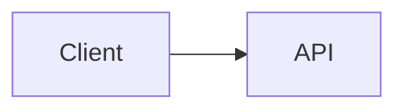

<div align="center">

# 🚀 MarkdownFly (mfly)

**用 Markdown 写幻灯片，秒级导出原生可编辑 `.pptx`**  
无需无头浏览器，无需 JVM，只需 Node

[](https://www.npmjs.com/package/markdownfly)
[](https://www.npmjs.com/package/markdownfly)
[](./LICENSE)
[](https://nodejs.org)
[](#-安装-skill)

[English](./README.md) · [简体中文](./README_CN.md)

</div>

---

<details>
<summary>📖 目录</summary>

- [🧩 安装 SKILL](#-安装-skill)
- [✨ 功能特性](#-功能特性)
- [📦 安装](#-安装)
- [🚀 快速上手](#-快速上手)
- [🎨 内置主题](#-内置主题)
- [📝 Markdown 语法指南](#-markdown-语法指南)
  - [幻灯片分割规则](#幻灯片分割规则)
  - [Frontmatter 配置](#frontmatter-配置)
  - [幻灯片内布局（网格）](#幻灯片内布局网格)
  - [幻灯片指令](#幻灯片指令-)
  - [Callout 卡片](#callout-卡片)
  - [任务清单](#任务清单)
  - [图片](#图片)
  - [视频](#视频)
  - [语法高亮代码块](#语法高亮代码块)
  - [图表代码块](#图表代码块)
  - [注释（`%%` 草稿行）](#注释-草稿行)
  - [封面作者 / 日期行](#封面作者--日期行)
  - [图片页自动布局](#图片页自动布局)
  - [注意事项](#注意事项)
- [🧪 测试](#-测试)
- [🤔 为什么选择 MarkdownFly？](#-为什么选择-markdownfly)
- [⭐ Star 趋势](#-star-趋势)
- [📄 许可证](#-许可证)

</details>

---

## 🧩 安装 SKILL

把下面这段话发给你的 AI 助手（ZCode、Claude Code 等支持 Agent Skills 的工具）—— 它会全程自动完成安装：

```text
请帮我安装 markdownfly skill：
1. 克隆仓库 https://github.com/Kyvin-Guan/markdownFly.git 到临时目录
2. 把其中的 skills/markdownfly/ 完整复制到 ~/.agents/skills/markdownfly/
   （Windows PowerShell: Copy-Item -Recurse <临时目录>\skills\markdownfly $HOME\.agents\skills\markdownfly）
3. 完成后告诉我已装好，并教我怎么使用这个skill
---
如果出现网络或安装错误：
方案1：使用skillhub平台安装skill:请根据 https://skillhub.cn/install/skillhub.md，安装 @user_48c8aa39/markdownfly。
方案2：将仓库地址换成 https://gitee.com/gitee-guan/markdownFly.git 进行操作。

```

安装后新开会话，随口说一句：

> 用 markdownfly 做一个 5 页的 REST API 技术分享，要有架构图和代码高亮

Agent 会先给出 Markdown 草稿预览，你确认或提修改意见后，再生成可编辑的 `.pptx`。

**前提：** Node.js 20+，skill 内部通过 `npx` 调用 CLI，无需手动安装。  
**手动安装：** 把 `skills/markdownfly/` 复制到 `~/.agents/skills/`（全局）或 `<项目>/.agents/skills/`（仅该项目）。

---

## ✨ 功能特性

- 📑 **Markdown → 可编辑 .pptx**：标准 Markdown 直接生成可在 PowerPoint 中继续编辑的 16:9 宽屏幻灯片。
- 🎨 **Token 级语法高亮**：[Shiki](https://shiki.style/) 驱动，支持 Python、TypeScript、Go、Rust、Java、C++、Bash、SQL 等 20+ 语言。
- 📊 **4 种图表引擎 — 无需 JVM，无需无头浏览器**：
  - **Mermaid** — 流程图、时序图、状态图、类图
  - **Graphviz / DOT** — 网络图、有限状态机、架构拓扑（WASM）
  - **PlantUML** — 时序、类、活动、组件图等（TeaVM — 零 JVM 依赖）
  - **ECharts** — 从 JSON 直接渲染柱状图、折线图、饼图（SSR）
- 🖼️ **灵活的图片支持**：本地路径、远程 URL、base64 Data URI；SVG 自动光栅化，兼容所有阅读器。
- 🎬 **原生视频嵌入**：`` 插入本地视频，放映时可直接在幻灯片内播放，支持自定义封面。
- 📐 **智能自动布局**：自动识别标题页、章节页、代码页、引用页和图片页，无需手动指令。
- 🎭 **可组合主题系统**：4 个开箱即用预设（`blue` · `emerald` · `gold` · `slate`），或自由拼装色彩 × 文字 × 版式槽位。
- ⚡ **批量转换 & CI 友好**：`mfly *.md`、`--json` 输出、`--quiet` 静默模式，随时接入流水线。

---

## 📦 安装

需要 Node.js 20+。

```bash
# 全局安装（推荐）
npm install -g markdownfly

# 无需安装，直接运行
npx markdownfly@latest slides.md
```

从源码开发：

```bash
# 克隆并安装依赖
git clone https://github.com/Kyvin-Guan/markdownFly.git
cd markdownFly
pnpm install
pnpm build
```

链接到全局 CLI：
```bash
pnpm link --global
```

---

## 🚀 快速上手

### 基础用法

```bash
# 转换单个文件（输出文件名与输入一致：slides.md → slides.pptx）
mfly slides.md

# 指定主题——预设：blue, emerald, gold, slate；仅色彩：ocean, ocean-dark, forest, champagne, graphite
mfly slides.md -t blue
mfly slides.md -t emerald
mfly slides.md -t ocean-dark

# 指定自定义输出路径
mfly slides.md -t blue -o presentation.pptx

# 自由搭配（可选高级能力）：单独覆盖色彩 / 文字 / 版式
mfly slides.md -t blue --text kai        # blue 配色+版式，文字换楷体
mfly slides.md --color forest --text academic --layout golden  # 完全自选拼装
mfly slides.md --layout minimal          # 只换版式，其余走默认主题 blue

# 批量转换多个 Markdown 文件
mfly docs/*.md
```

拼装旗标：

- `--color <name>` 色彩方案：`ocean, ocean-dark, forest, champagne, graphite`
- `--text <name>` 文字方案：`system, academic, kai, source-han-serif`
- `--layout <name>` 版式方案：`legacy, folio, golden, minimal`

拼装参数会**精确覆盖**主题对应槽位（优先级：拼装 > 主题预设 > 默认）；只写拼装、不写 `-t` 时以默认主题 `blue` 打底。拼装名不合法时以退出码 `1` 失败并列出可用名。

若默认输出文件名已存在，会自动使用带时间戳的文件名（`slides-20260907-131500.pptx`）而非覆盖。使用 `-o` 时会直接覆盖目标文件。

### 自动化（`--quiet` / `--json`）

```bash
# 机器可读结果（stdout 输出一行 JSON；诊断信息输出到 stderr）
mfly slides.md --json

# 抑制每个文件的进度输出
mfly docs/*.md --quiet
```

- `--json` 在 stdout 输出单个 JSON 对象：
  `{"ok":true,"durationMs":1234,"files":[{"input":"slides.md","output":"C:/abs/slides.pptx","ok":true}]}`。
  单文件失败时 `ok:false` 并附带 `error` 字段。
- 仅当**所有**文件转换成功时退出码为 `0`；任意文件失败则退出 `1`（stderr 输出汇总行）。
- `-t` 指定未知主题名时以退出码 `1` 失败（Markdown frontmatter 中的未知主题名会回退到默认主题 `blue` 并输出警告）。
- 进度信息输出到 stderr；错误和警告始终输出到 stderr。

---

## 🎨 内置主题

一个主题由三个槽位构成 —— **色彩 × 文字 × 版式**。`-t` / frontmatter
`theme:` 使用**主题名**，解析顺序为**主题预设 → 色彩方案**；两者都不写时
使用默认主题 **`blue`**。

### 主题预设（一个名字选齐三个槽位）

| 主题名 | 色彩 | 文字 | 版式 | 适合场景 |
| :--- | :--- | :--- | :--- | :--- |
| **`blue`** *(默认)* | `ocean` | `academic`（宋体） | `legacy` | 默认完整主题，技术分享 |
| `emerald` | `forest` | `system`（微软雅黑） | `folio` | 清新绿 · 编辑册页 |
| `gold` | `champagne` | `kai`（楷体） | `golden` | 温暖金 · 黄金比例版式 |
| `slate` | `graphite` | `source-han-serif`（思源宋体） | `minimal` | 中性灰白 · 归档极简 |

### 槽位菜单 —— 自由组合出更多主题

除四个预设外，每个槽位都有自己的内置可选值。任意配色可搭配任意文字方案
和任意版式方案，能拼出的主题远不止预设这几个名字。

**色彩方案**（也可直接用作 `-t` 名，只换配色）：

| 名称 | 墨色（文字）/ 纸色（背景） | 主色 / 辅色 | 说明 |
| :--- | :--- | :--- | :--- |
| `ocean` | `#1E4A6F` / `#F0F8FF` | `#4F9FD9` / `#2D6A9F` | 浅色海蓝 |
| `ocean-dark` | `#D6E7F5` / `#0B1C2E` | `#5BAAE8` / `#8BBCDD` | 夜场深色（`ocean` 反色） |
| `forest` | `#2A4A3F` / `#F0FFF5` | `#5F9A8A` / `#3F6A5A` | 清新绿 |
| `champagne` | `#CFB53B` / `#FFFCE6` | `#E5CD5F` / `#F5E08A` | 温暖金属金 |
| `graphite` | `#4D4D4D` / `#F8F8F8` | `#D9D9D9` / `#A6A6A6` | 中性灰白 |

**文字方案**：

| 名称 | 字体 |
| :--- | :--- |
| `system` | 平台系统字体（微软雅黑族）— 主题未指定文字时的默认值 |
| `academic` | 宋体，西文为 Times 风格 |
| `kai` | 楷体 |
| `source-han-serif` | 思源宋体 |

**版式方案**：

| 名称 | 风格 |
| :--- | :--- |
| `legacy` | 经典 mfly 版式包（`blue` 默认） |
| `folio` | 编辑排印、书页式留白 |
| `golden` | 黄金比例构图 |
| `minimal` | 极少装饰、大量留白 |

### 组合规则

```bash
mfly deck.md -t blue --text kai            # blue 配色 + 版式，文字换楷体
mfly deck.md --color forest --text academic --layout golden   # 完全自选拼装
mfly deck.md --layout minimal              # 只换版式，其余走默认 blue
```

- 槽位可通过 `--color` / `--text` / `--layout`（或 frontmatter
  `color_scheme` / `text_scheme` / `layout_scheme`）逐一覆盖。
- 优先级：拼装旗标 > frontmatter 方案 > 主题预设槽位 > 默认 `blue`。只写
  拼装旗标、不写 `-t` 时以 `blue` 打底。
- 仅配色名（如 `-t ocean`）保留默认 `system` 文字与内置默认版式。
- 名称不合法时：CLI 旗标以退出码 `1` 失败并列出可用名。frontmatter 中不会
  失败 —— 未知 `theme:` 警告并回退到 `blue`；未知 `color_scheme` 保留主题
  原色彩；未知 `text_scheme` 回退到 `system`；未知 `layout_scheme` 回退到
  内置版式。
- 库使用者可通过 `registerThemePreset` / `registerColorScheme` /
  `registerTextScheme` / `registerLayoutScheme` 注册全新的槽位取值。

---

## 📝 Markdown 语法指南

### 幻灯片分割规则

- `---`（水平线）：主要幻灯片分隔符。
- `# 一级标题`：创建带**标题（封面）**布局的新幻灯片。
- `## 二级标题`：创建带**内容**或**章节**布局的新幻灯片。

### Frontmatter 配置

```yaml
---
theme: blue # 可选：blue（默认）, emerald, gold, slate, ocean, ocean-dark, forest, champagne, graphite
color_scheme: champagne # 可选：覆盖主题色彩的色彩方案（ocean, ocean-dark, forest, champagne, graphite）
text_scheme: kai # 可选：覆盖主题文字的文字方案（system, academic, kai, source-han-serif）
layout_scheme: folio # 可选：覆盖主题版式的版式方案（legacy, folio, golden, minimal）
author: "你的名字"
footer: "保密 - {page} / {total}" # {page}/{total}/{section}/{title}
resource_dir: ./assets # 相对图片路径的基础目录
layout: code # 内容幻灯片的可选默认布局
---
```

### 幻灯片内布局（网格）

用单独的标记行将幻灯片分割为多列/多行 — 无需额外标记：

````markdown
## 架构概览

### 架构图

<->                   <!-- 左右分栏：左边放图 -->

### 关键点
- 低延迟
- 可扩展
- 成本可控
===                   <!-- 上下分块：下面是另一行内容 -->

### 总结
> [!TIP]
> `===` 让一页拆成上下块，适合前后对比。
````

- `<->`（独立行）：水平分隔符 → **分栏**（并排显示）。
- `===`（独立行）：垂直分隔符 → **分行**（上下堆叠）。
- 两者组合可创建网格。代码块内的标记不会被解析。

### 幻灯片指令 `@(...)`

在幻灯片底部写一行单独的 `@(key=value, ...)` 来设置该幻灯片的选项：

```markdown
## 表格变图表

| 季度 | 订单量 |
| :--- | :--- |
| Q1 | 320 |
| Q2 | 580 |

@(chart=bar, notes=这里口头展开Q1-2数据)
```

| 指令 | 值 | 效果 |
| :--- | :--- | :--- |
| `layout` | `title` / `section` / `content` / `code` / `quote` / `closing` / `image-single` / `image-double` / `image-triple` | 覆盖自动检测的布局 |
| `notes` | 文本 | 该幻灯片的演讲者备注 |
| `chart` | `bar` / `line` / `pie` | 将第一个表格渲染为图表（表格至少 2 列、1 行数据） |
| `highlight` | `2-4,6` | 高亮幻灯片代码块中的指定行 |
| `background` | URL / 路径 / `#RRGGBB` | 幻灯片背景图片，或纯色背景 |
| `steps` | `true` | 渐进式展示（保留功能） |

`closing` 只能通过指令触发（自动检测不会产生）：居中的致谢页 —— 页标题作为致谢语（默认 `Thank you`），副标题渲染在其下方（如联系方式）。

### Callout 卡片

```markdown
> [!NOTE]
> 需要记住的重要信息。

> [!TIP]
> 有用的建议。

> [!WARNING]
> 需要注意的内容。
```

支持的变体：`NOTE` / `INFO` / `TIP` / `SUCCESS` / `WARNING` / `CAUTION` / `DANGER` — 渲染为主题风格的强调卡片。

也可以在标记后写上自定义标题：`> [!NOTE] 部署提醒`。

### 任务清单

```markdown
- [x] 已完成项目
- [ ] 待办项目
```

### 图片

单独的图片行会渲染为幻灯片元素（保持宽高比，在列中居中）。路径相对于 Markdown 文件解析，或相对于 `resource_dir`（本身相对于 Markdown 文件解析，而非当前工作目录）；远程 URL（`http/https`）和 base64 data URI 同样支持。缺失或失败的图片会跳过并在 stderr 输出警告 — 文档仍会正常生成。

```markdown
{w=6in,align=center}
{w=60%}
{width=120px,height=40mm,align=right}
```

- 键名：`w`/`width`、`h`/`height`、`align`（`left`/`center`/`right`，默认 `center`）
- 单位：`px`（默认）、`pt`、`cm`、`mm`、`in`/`inch`、`%`（相对于列宽；单一值时保持宽高比）
- 无效参数会被静默忽略 — 图片仍会正常渲染
- 格式：`png`、`jpg`/`jpeg`、`gif`、`webp`、`bmp`、`svg`。alt 文本会写入 PPTX，因此 `` 就是屏幕阅读器朗读的内容。
- ⚠ `webp` 会原样存储，但并非所有阅读器都能解码 — PowerPoint for the web 和 Office 2019 及更早版本会显示图片损坏。stderr 会输出警告。
- `svg` 在嵌入时会光栅化为 PNG（宽 1200px），在所有阅读器中渲染一致。会保留作者的原始框架，包括 viewBox 中内置的任何边距。代价是：文档携带的是栅格而非矢量，不再无损缩放，且 SVG 较多的文档体积更大。
- ⚠ 安全：图片路径（`` 和 `@(background=...)`）解析时无任何限制 — 请只转换您自己拥有或信任的 Markdown。

### 视频

图片行的源是视频文件时，会嵌入原生可播放的视频 — 等同于 PowerPoint 的"插入 → 此设备上的视频"：

```markdown

{w=6in,align=left,poster=cover.png}
```

- 仅支持本地文件，路径解析规则与图片一致（相对于 Markdown 文件或 `resource_dir`）；文件缺失时跳过并输出警告。不支持在线 `http(s)` 链接 — 会拒绝并提示先下载到本地。
- 格式：`mp4`、`m4v`、`mov`、`mkv`、`avi`、`wmv`、`webm`。H.264 编码的 MP4 在 PowerPoint 中兼容性最好。
- 尺寸键与图片相同（`w`/`h`/`align`）；不指定时按 16:9 适配列宽。
- `{poster=cover.png}` 设置播放前显示的封面图（仅限 PNG），始终优先。不指定时会用机器上已有的工具自动提取真实画面帧（PATH 上的 ffmpeg、Windows 系统缩略图、macOS 快速预览）；全部不可用时自动生成主题色封面卡片 — 不会出现灰色默认框。
- 同一视频在同一页引用多次只嵌入一份。
- 视频在内容页布局中渲染，不适用 `image-single/double/triple` 图片页槽位。视频文件原样嵌入，文档体积会随之增大。

### 语法高亮代码块

`````markdown
````typescript
interface User {
  id: string;
  name: string;
}

function greet(user: User): string {
  return `Hello, ${user.name}!`;
}
````
`````

`````markdown
````python
def quick_sort(arr): ...
````
@(highlight=1,3-4)   <!-- 高亮指定行 -->
`````

### 图表代码块

`````markdown
````mermaid
graph TD
    A[Client] --> B[API Gateway]
    B --> C[Auth Service]
    B --> D[Data Service]
````

````dot
digraph Architecture {
    rankdir=LR;
    node [shape=box, style=filled, fillcolor=lightblue];
    Frontend -> Backend -> Database;
}
````

````echarts
{
  "xAxis": { "type": "category", "data": ["Q1", "Q2", "Q3", "Q4"] },
  "yAxis": { "type": "value" },
  "series": [{ "data": [150, 230, 224, 218], "type": "bar" }]
}
````

````plantuml
@startuml
Alice -> Bob : 登录请求
Bob --> Alice : 登录成功
@enduml
````
`````

支持的图表语言：`mermaid`、`dot`（别名 `graphviz`）、`echarts`、`plantuml`（别名 `puml`）。
图表幻灯片遵循演示主题，包括其暗色配色方案。

PlantUML 说明：

- `@startuml`/`@enduml` 包裹是可选的 — 裸源码会自动添加包裹，未闭合的 `@startuml` 也会自动补全。
- `!theme` 不可用（打包的引擎不包含主题文件）；请改用 `skinparam`。该指令会跳过并输出警告，而不会导致图表失败。
- 设置 `MFLY_DEBUG=1` 可将 PlantUML 引擎的内部日志转发到 stderr；默认静音以避免干扰 stdout。
- 图表错误不会导致文档生成失败：受影响的幻灯片会显示红色占位符，演示文档其余部分仍会正常生成。

#### 注释（`%%` 草稿行）

以 `%%` 开头的独立行会被完全移除，绝不进入幻灯片——适合写不会出现的草稿/批注。代码块内部不受影响。

```markdown
%% 这行不会出现在你的幻灯片里
```

#### 封面作者 / 日期行

首页封面会识别以 `作者：…` / `日期：…` 开头的行（可多行）作为封面元信息，而不是正文段落：

```markdown
作者：张三
日期：2026-10-04
```

#### 图片页自动布局

一页只含 1–3 张图片且没有大段正文时，会自动识别为图片页布局（`image-single` / `image-double` / `image-triple`）。也可显式指定，包括通过 `layout` 指令：

```markdown
@(layout=image-single)
```

### 注意事项

- 单独的 `===` 始终表示行分隔 — setext 风格标题（`标题` + `===`）在 mfly 中等同于 `# 一级标题`。
- 单独的 `<->` 始终表示列分隔；使用 `***text***` 表示粗斜体（moffee 约定的 `<->粗斜体<->` 写法故意未采用，以避免歧义）。

---

## 🧪 测试

```bash
# 运行所有单元测试和集成测试
pnpm test
```

---

## 🤔 为什么选择 MarkdownFly？

| 功能 | **MarkdownFly** | Marp | Slidev | reveal.js |
| :--- | :---: | :---: | :---: | :---: |
| 输出格式 | ✅ `.pptx`（可编辑） | PDF / HTML | HTML | HTML |
| 无需浏览器 / headless Chrome | ✅ | ❌ | ❌ | ❌ |
| 图表渲染无需 JVM / 无头浏览器 | ✅ | ❌ | ❌ | ❌ |
| Mermaid / Graphviz / PlantUML / ECharts | ✅ 全部支持 | 仅 Mermaid | 仅 Mermaid | ❌ |
| CLI 优先，CI/CD 友好 | ✅ | ✅ | ⚠️ | ❌ |
| 语法高亮代码块 | ✅ Shiki | ✅ | ✅ | ⚠️ |
| 导出后幻灯片可二次编辑 | ✅ | ❌ | ❌ | ❌ |
| 幻灯片内网格布局 | ✅ `<->` / `===` | ❌ | ⚠️ | ❌ |

> **一句话总结** — MarkdownFly 是唯一无需 JVM 和无头浏览器、支持全套图表渲染，并导出可继续用 PowerPoint 编辑的 `.pptx` 的 Markdown 工具。

---

## ⭐ Star 趋势

<div align="center">

[](https://star-history.com/#Kyvin-Guan/markdownFly&Date)

</div>

---

## 📄 许可证

MIT License © 2026 MarkdownFly Contributors

---

<div align="center">

Made with ❤️ by [MarkdownFly Contributors](https://github.com/Kyvin-Guan/markdownFly/graphs/contributors)

</div>
