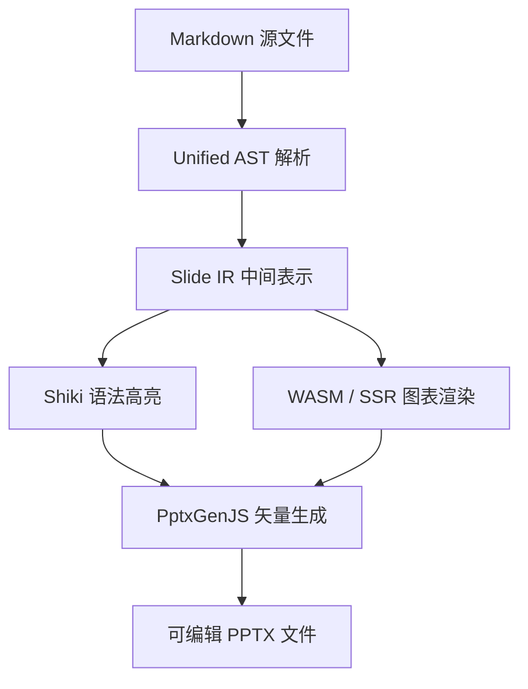
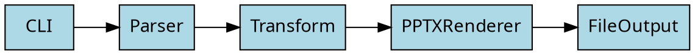
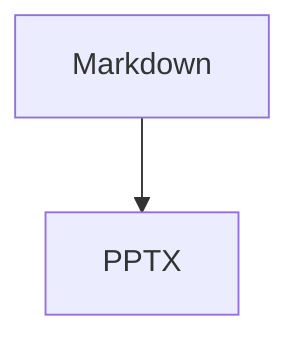

# MarkdownFly 全特性演示
## 一键将 Markdown 转换为专业、精美的 16:9 矢量 PPTX

---

## 项目概览

- 📑 **Markdown 原生驱动**：使用极简的 Markdown 语法组织演示文稿
- 🎨 **Shiki 级代码高亮**：精准到 Token 级别的现代语法着色
- 📊 **免原生依赖图表**：Mermaid、Graphviz/DOT、ECharts SSR 矢量渲染
- 📐 **智能版式识别**：自动判断封面、章节过渡页、代码页、引用页与内容页
- 🌈 **内置 5 大预设主题**：`clean`、`academic`、`dark`、`business`、`warm`

---

## 01. 核心架构与图表支持

---

## 架构拓扑图 (Mermaid)



---

## 模块网络拓扑 (Graphviz / DOT)



---

## 数据可视化图表 (ECharts 柱状图)

```echarts
{
  "xAxis": {
    "type": "category",
    "data": ["Q1 2026", "Q2 2026", "Q3 2026", "Q4 2026"]
  },
  "yAxis": {
    "type": "value"
  },
  "series": [
    {
      "data": [320, 580, 750, 920],
      "type": "bar"
    }
  ]
}
```

---

## 02. 代码高亮与多语言支持

---

## TypeScript 代码演示

```typescript
export interface PresentationConfig {
  theme: 'clean' | 'academic' | 'dark' | 'business' | 'warm';
  author?: string;
  footer?: string;
}

export class MarkdownFly {
  public async render(source: string, config: PresentationConfig): Promise<Buffer> {
    console.log(`Rendering presentation with theme: ${config.theme}`);
    return Buffer.from([]);
  }
}
```

---

## Python 算法演示

```python
def quick_sort(arr: list[int]) -> list[int]:
    """高性能快速排序实现"""
    if len(arr) <= 1:
        return arr
    pivot = arr[len(arr) // 2]
    left = [x for x in arr if x < pivot]
    middle = [x for x in arr if x == pivot]
    right = [x for x in arr if x > pivot]
    return quick_sort(left) + middle + quick_sort(right)

print(quick_sort([3, 6, 8, 10, 1, 2, 1]))
```

---

## 03. 排版与排列表格

---

## 主题特性对比表

| 主题名称 | 风格定位 | 推荐场景 | 特色色彩 |
| :--- | :--- | :--- | :--- |
| **clean** | 净白现代 | 日常技术分享、通用清晰演示 | 科技蓝 + 纯白底 |
| **academic** | 学术严谨 | 论文答辩、算法/公式汇报 | 普鲁士蓝 + 酒红 |
| **dark** | 暗黑极客 | 开发者大会、源码深度剖析 | 电光青 + 墨黑底 |
| **business** | 商务稳重 | 述职汇报、正规商务会议 | 藏青 + 琥珀金 |
| **warm** | 温润大地 | 慢调演讲、设计与故事叙述 | 森林墨绿 + 暖米底 |

---

> "Simplicity is prerequisite for reliability."
> 简单是可靠的先决条件。
> — Edsger W. Dijkstra

---

# 感谢观看 · Q&A
## MarkdownFly — 释放程序员的表达力

---

## 页内布局演示

### 左图右文

<->

### 右侧要点
- `<->` 左右分栏
- `===` 上下分块
- 可组合成网格

===

### 底部提示

> [!TIP]
> `===` 让一页拆成上下两块,适合方案对比。

---

## 任务清单与 Callout

- [x] 页内布局 `<->` / `===`
- [x] Callout `[!NOTE]` 系列
- [x] 表格秒变图表 `@(chart=bar)`
- [ ] LaTeX 公式(规划中)

> [!WARNING]
> 独立成行的 `===` 是分块标记,不能再用于 setext 标题。

---

## 表格变图表

| 季度 | 订单量 | 营收 |
| :--- | :--- | :--- |
| Q1 | 320 | 45 |
| Q2 | 580 | 72 |
| Q3 | 750 | 90 |

@(chart=bar, notes=结合柱状图解读Q3增长趋势)

---

## 代码行高亮

```typescript
export class MarkdownFly {
  private theme: Theme = cleanTheme;   // 第 3 行
  public render(source: string) { ... }
}
```

@(highlight=3)
