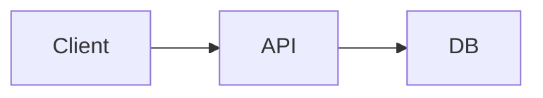

# MarkdownFly (mfly) — Markdown to PowerPoint

One Markdown file in, one fully editable `.pptx` out. No JVM, no headless
browser. Requires Node.js 20+. Run it via npx — no install step:

```bash
npx -y markdownfly@latest deck.md
```

## Workflow

### 1. Gather requirements

Before writing, establish (ask only what the user didn't say): audience,
language, rough slide count, and style. Map style to a theme: technical →
`blue` (default) or `ocean-dark`; warm/humanities → `gold`; fresh/editorial →
`emerald`; neutral minimal → `slate`. Read [references/themes.md](references/themes.md)
before customizing colors/fonts/layouts beyond the preset names.

### 2. Write the deck markdown

One file, slides separated by `---`. `#` makes the cover, `##` makes content
or section slides. One idea per slide. Tag every fenced code block with its
language (Shiki highlights 20+ languages). Diagrams are fenced code blocks too:

````markdown
---
theme: blue
author: "Your Name"
---

# Project Title

作者：Alice
日期：2026-10-05

---

## Architecture



<->

### Key points

- Low latency
- Horizontally scalable

@(notes=Walk through the request path left to right here.)

---

## Summary

> [!TIP]
> Ship small, ship often.
````

Default rule: write plain, predictable Markdown and let auto-layout do its
job. Read [references/markdown-syntax.md](references/markdown-syntax.md)
before using grid markers (`<->`, `===`), image sizing params, per-slide
directives beyond `notes`, or non-mermaid diagram languages — the exact
grammar lives there.

### 3. Convert

```bash
npx -y markdownfly@latest deck.md --json
```

- Exit code `0` = every file converted. Exit `1` = at least one failure or a
  usage error (unknown theme, no matching files, `-o` with multiple files).
- `--json` prints ONE JSON object on stdout; diagnostics go to stderr:

```json
{"ok":true,"durationMs":2102,"files":[{"input":"deck.md","output":"C:/abs/path/deck.pptx","ok":true}]}
```

- Pin the version if reproducibility matters: `npx -y markdownfly@0.2 ...`.

### 4. Verify and report

1. Check the exit code and the `ok` field; read `files[].output` for the
   absolute product path.
2. **Read stderr too**: missing images, failed remote fetches, and diagram
   errors print warnings there but the deck is still generated — relay them to
   the user instead of silently passing.
3. Optional visual check if LibreOffice is available: convert to PNG and
   inspect (`soffice --headless --convert-to pdf deck.pptx`). Skip if absent.
4. Report the absolute output path and any warnings. Never claim diagrams or
   images rendered if stderr said otherwise.

## CLI contract

| Flag | Effect |
| :--- | :--- |
| `mfly <files...>` | Convert one or more files (globs allowed) |
| `-o <path>` | Output path (single input only; overwrites) |
| `-t <name>` | Theme: `blue` (default), `emerald`, `gold`, `slate`, `ocean`, `ocean-dark`, `forest`, `champagne`, `graphite` |
| `--color <name>` | Override color scheme: `ocean, ocean-dark, forest, champagne, graphite` |
| `--text <name>` | Override text scheme: `system, academic, kai, source-han-serif` |
| `--layout <name>` | Override layout scheme: `folio, legacy, golden, minimal` |
| `--quiet` | Suppress per-file progress lines |
| `--json` | Machine-readable result on stdout |

- Without `-o`, output is `<input>.pptx` next to the source; if that name
  exists a timestamped name is used instead.
- Unknown `-t` / `--color` / `--text` / `--layout` names fail with exit `1`
  and list valid names. Unknown theme in frontmatter only warns and falls
  back to `blue`.

## Frontmatter template

```yaml
---
theme: blue            # preset or color-only name (see themes reference)
color_scheme: champagne  # optional slot overrides
text_scheme: kai
layout_scheme: folio
author: "Your Name"
footer: "Confidential - {page} / {total}"  # {page}/{total}/{section}/{title}
resource_dir: ./assets # base dir for relative image paths
layout: code           # default layout for content slides (rarely needed)
---
```

## Pitfalls

- Image paths (and `resource_dir`) resolve against the **markdown file's
  directory**, never the shell's cwd — run the CLI from anywhere.
- A missing/broken image or failed remote fetch → stderr warning, deck still
  generated, slide just omits the image. Decide with the user whether to fix
  the source.
- `%% comment` lines are stripped from the deck entirely; code fences are safe.
- PlantUML: the `@startuml`/`@enduml` envelope is optional, `!theme` is not
  available (use `skinparam`), and `MFLY_DEBUG=1` forwards engine logs to stderr.
- `webp` images embed but PowerPoint for the web / Office ≤2019 show them
  broken — prefer `png`/`jpg`.
- Setext-style headings don't exist here: a standalone `===` line is a row
  break, so write `# Heading`, not `Heading` + `===`.
- If behavior looks wrong, run `npx -y markdownfly@latest --version` first —
  an older cached npx copy may lack the flags documented here.
