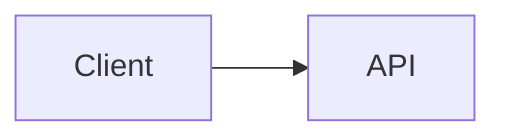
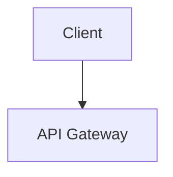
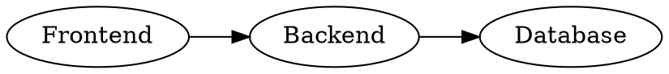
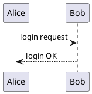

# MarkdownFly Markdown Syntax Reference

Complete grammar for deck files. Read this before writing non-trivial layouts,
image sizing, per-slide directives, or non-mermaid diagrams. Everything below
is verified against markdownfly v0.2.

## Slide Splitting

- `---` (horizontal rule): primary slide separator.
- `# Heading 1`: new slide with the **cover/title** layout (the first one becomes the deck cover).
- `## Heading 2`: new slide with **content** or **section** layout (a bare `##` with no body becomes a section divider).

## Frontmatter Fields

```yaml
---
theme: blue              # preset or color-only theme name
color_scheme: champagne  # override the theme's color slot
text_scheme: kai         # override the theme's text/font slot
layout_scheme: folio     # override the theme's layout slot
author: "Your Name"
footer: "Confidential - {page} / {total}"  # placeholders: {page} {total} {section} {title}
resource_dir: ./assets   # base directory for relative image paths (relative to THIS file)
layout: code             # default layout for content slides
---
```

All fields are optional. CLI flags override frontmatter. Unknown names in
frontmatter never fail the deck: unknown `theme:` warns and falls back to
`blue`; unknown `color_scheme` keeps the theme's color; unknown `text_scheme`
falls back to `system`; unknown `layout_scheme` falls back to the built-in
layout pack.

## In-Slide Grid Layout

Standalone marker lines split a slide into columns and rows — no other markup needed:

````markdown
## Architecture Overview

### Diagram

<->

### Key points

- Low latency
- Cost-efficient
===

### Summary

> [!TIP]
> `===` starts a new stacked row.
````

- `<->` (standalone line): split into **columns** (side by side).
- `===` (standalone line): split into **rows** (stacked).
- Combine both for grids. Markers inside code blocks are never interpreted.

## Per-Slide Directives `@(...)`

A standalone `@(key=value, ...)` line at the bottom of a slide sets options:

| Directive | Value | Effect |
| :--- | :--- | :--- |
| `layout` | `title` / `section` / `content` / `code` / `quote` / `closing` / `image-single` / `image-double` / `image-triple` | Override auto-detected layout |
| `notes` | text | Speaker notes (added to the pptx notes pane) |
| `chart` | `bar` / `line` / `pie` | Render the slide's first table as an ECharts chart (table needs ≥2 columns and ≥1 data row) |
| `highlight` | `2-4,6` | Highlight those lines in the slide's code block |
| `background` | URL or path | Slide background image (`#RRGGBB` also accepted as a color) |
| `steps` | `true` | Progressive reveal (reserved, no effect yet) |

Example: `@(chart=bar, notes=walk through Q1-Q2 here)`

`closing` is directive-only (auto-detection never picks it): a centered
thank-you page — the slide's title renders as the thank-you text (default
`Thank you`) and the subtitle renders below it (e.g. contact info).

## Callouts

```markdown
> [!NOTE]
> Important point.

> [!TIP] Deploy reminder
> Custom title after the marker.
```

Variants: `NOTE` / `INFO` / `TIP` / `SUCCESS` / `WARNING` / `CAUTION` /
`DANGER` — rendered as theme-styled accent cards. A title written after the
marker replaces the variant name on the card.

## Task Lists

```markdown
- [x] Completed item
- [ ] Upcoming item
```

## Images

A standalone image line renders as a slide element (aspect preserved,
centered in its column):

```markdown
{w=6in,align=center}
{w=60%}
{width=120px,height=40mm,align=right}
```

- **Sizing keys**: `w`/`width`, `h`/`height`, `align` (`left`/`center`/`right`, default `center`).
- **Units**: `px` (default), `pt`, `cm`, `mm`, `in`/`inch`; `%` is relative to the column (single value keeps aspect ratio).
- Invalid sizing params are ignored; the image still renders.
- **Supported formats**: `png`, `jpg`/`jpeg`, `gif`, `webp`, `bmp`, `svg`. Alt text is carried into the pptx.
- `webp`: embeds as-is but PowerPoint for the web and Office ≤2019 show it broken (warning printed). `svg`: rasterized to a 1200px-wide PNG on embed.
- **Sources**: local paths (resolved against the markdown file's directory, or against `resource_dir` — both independent of the shell cwd), remote `http(s)://` URLs (10 s timeout), and base64 `data:` URIs.
- **Failure mode**: missing or unfetchable images are skipped with a stderr warning; the deck is still produced.
- **Security**: paths are resolved without restrictions — only convert markdown you trust.

## Videos

An image line whose source is a video file embeds a native, playable video
(like PowerPoint's Insert → Video on my PC) instead of a picture:

```markdown

{w=6in,align=left}
{poster=cover.png,w=80%}
```

- **Local files only**: resolved against the markdown file's directory (or `resource_dir`), like images. A missing file is skipped with a warning.
- **Formats**: `mp4`, `m4v`, `mov`, `mkv`, `avi`, `wmv`, `webm`. H.264 MP4 has the best PowerPoint compatibility — recommend it.
- **No online videos**: an `http(s)` URL is rejected with a warning; download the file and reference it locally instead.
- **Sizing keys**: same `w`/`h`/`align` params as images; without them the video is fit to the column at an assumed 16:9 (use `{w=...,h=...}` when the aspect differs).
- **Cover**: `{poster=cover.png}` sets the pre-play cover (PNG only, a non-PNG warns) and always wins. Without it a real frame is extracted with tools already on the machine — ffmpeg on PATH, else the native OS thumbnailer (Windows shell thumbnail / macOS Quick Look); shell thumbnails under 640px wide are rejected as too blurry. If no usable frame is available, a themed cover card is rendered in the theme color, so PowerPoint's gray default never appears (a stderr note reports the fallback).
- The same video referenced twice on one slide is embedded once (content-hash dedupe).
- Videos render on **content slides** (auto-detected or default). They do not fit the `image-single/double/triple` slot layouts — a warning points there if one is forced via `@(layout=image-*)`.
- The video file is embedded into the pptx verbatim, so the deck grows by the file's size.

## Code Blocks

Tag the fence with a language for Shiki token highlighting (javascript,
typescript, python, java, c, cpp, csharp, go, rust, ruby, php, swift, kotlin,
bash, sql, html, css, json, yaml, markdown, xml, docker, and more; unknown
languages fall back to plain text). Use `@(highlight=1,3-4)` below the fence
to draw highlight bands on those lines.

## Diagram Code Blocks

````markdown




```echarts
{
  "xAxis": { "type": "category", "data": ["Q1", "Q2", "Q3", "Q4"] },
  "yAxis": { "type": "value" },
  "series": [{ "data": [150, 230, 224, 218], "type": "bar" }]
}
```


````

Accepted languages: `mermaid`, `dot` (alias `graphviz`), `echarts`,
`plantuml` (alias `puml`). Diagrams follow the deck theme (including dark
palettes) and are embedded as rasterized PNG.

PlantUML specifics:

- The `@startuml`/`@enduml` envelope is optional; bare source is wrapped, an
  unclosed `@startuml` is auto-closed.
- `!theme` is unavailable (bundled engine ships no theme files) — it is
  skipped with a warning. Use `skinparam` instead.
- `MFLY_DEBUG=1` (environment) forwards PlantUML engine logs to stderr.
- Diagram errors never fail the deck: the slide shows a red placeholder and
  the rest renders.

## Draft Comments

A standalone line starting with `%%` is removed before rendering. Lines
inside code fences are untouched.

## Cover Metadata Lines

On the first cover slide, lines prefixed `作者：` / `日期：` (Chinese full- or
half-width colon, multiple lines allowed) become cover metadata instead of
body paragraphs:

```markdown
# Quarterly Review

作者：Zhang San
日期：2026-10-05
```

## Image-Page Auto Layout

A slide containing 1–3 images and no substantial body text is auto-detected
as an image page (`image-single` / `image-double` / `image-triple`), or force
it with `@(layout=image-single)`.

## Quirks to Remember

- **No setext headings**: a standalone `===` is a row break. Write `# Heading`.
- **`<->`** is a column break; use `***bold italic***` for emphasis.
- **No HTML pass-through**: raw HTML in markdown is dropped.
- **Tables**: GFM tables; `@(chart=…)` turns the first one on the slide into a
  chart (table needs ≥2 columns and ≥1 data row).
