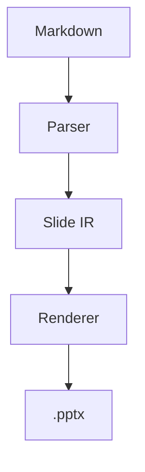
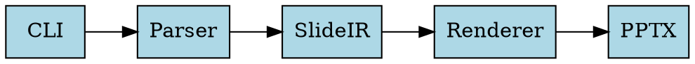

# MarkdownFly Demo

---

## Key Features

- AI-powered Markdown to PPT converter
- Built for programmers
- Supports code highlighting and diagrams
- Open source, MIT licensed

---

## Code Example

```python
def fibonacci(n):
    if n <= 1:
        return n
    return fibonacci(n - 1) + fibonacci(n - 2)

print(fibonacci(10))
```

---

> "The best way to predict the future is to invent it."
> — Alan Kay

---

## Architecture



---

## System Design



---

## Monthly Sales

```echarts
{
  "xAxis": { "type": "category", "data": ["Jan", "Feb", "Mar", "Apr", "May"] },
  "yAxis": { "type": "value" },
  "series": [{ "data": [120, 200, 150, 80, 270], "type": "bar" }]
}
```

---

## Feature Matrix

| Feature | Status |
|---------|--------|
| Markdown Parsing | ✅ |
| Code Highlighting | ✅ |
| Mermaid Diagrams | ✅ |
| Graphviz Support | ✅ |
| ECharts Charts | ✅ |
| AI Enhancement | 🔜 |

---

## Thank You!
